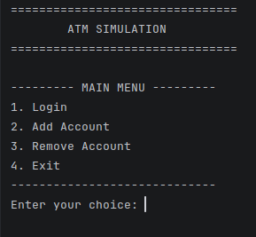
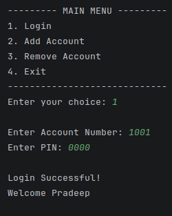
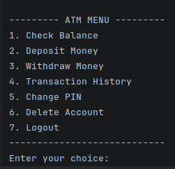
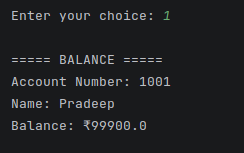
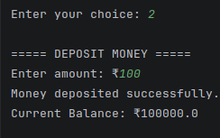
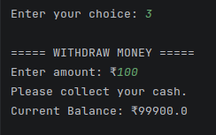
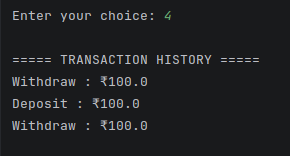
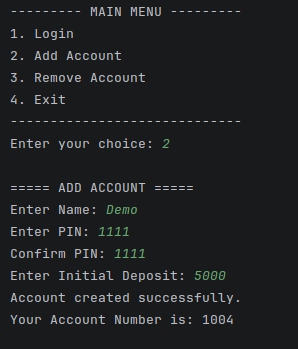
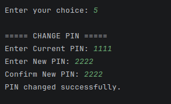
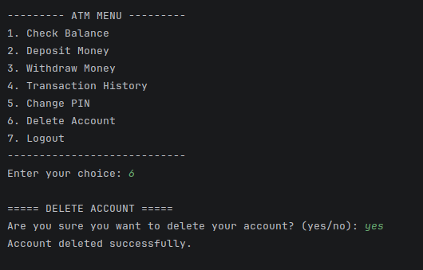

# 🏧 ATM Simulation System

## 📌 Project Overview

This project is a simple **terminal-based ATM Simulation System** developed using Java.

The system simulates common ATM and account management operations. Users can log in using their account number and PIN and perform operations such as checking balance, depositing money, withdrawing money, viewing transaction history, changing PIN, and deleting their account.

The system also provides account management options for adding and removing accounts.

Account details are stored in a text file and transaction records are stored separately in another text file. This makes the project simple to use while demonstrating Java file handling and object-oriented programming concepts.

---

## ✨ Features

### 🔐 Account Authentication

- Login using account number and PIN.
- Verify whether an account exists.
- Verify the entered PIN.
- Display an error message for invalid account details.
- Return to the main menu after an unsuccessful login.

### 💰 ATM Operations

- Check account balance.
- Deposit money.
- Withdraw money.
- View transaction history.
- Change PIN.
- Delete account.
- Logout.

### 👤 Account Management

- Create a new account.
- Automatically generate a new account number.
- Remove an existing account.
- Confirm PIN while creating an account.
- Validate the initial deposit amount.
- Save account information to the data file.

### 💵 Account Rules

- Minimum initial deposit: **₹1,000**
- Maximum initial deposit: **₹1,00,000**
- Maximum account balance: **₹1,00,000**
- Deposit amount must be greater than zero.
- Withdrawal amount must be greater than zero.
- Withdrawal amount cannot be greater than the available balance.

### 📜 Transaction History

- Store deposit transactions.
- Store withdrawal transactions.
- Display transactions for the logged-in account.
- Keep transaction data in a separate text file.

---

## 🛠️ Technologies / Tools Used

- **Java**
- **Java Collections Framework**
- **ArrayList**
- **Java I/O**
- **File Handling**
- **BufferedReader**
- **BufferedWriter**
- **FileReader**
- **FileWriter**
- **Scanner**
- **VS Code**
- **Git**
- **GitHub**

---

## 📂 Project Structure

```text
ATM-Simulation/
│
├── README.md
├── statement.md
├── .gitignore
│
├── src/
│   ├── Main.java
│   ├── Account.java
│   ├── FileManager.java
│   ├── Authentication.java
│   ├── AccountManager.java
│   ├── Balance.java
│   ├── Deposit.java
│   ├── Withdraw.java
│   ├── TransactionHistory.java
│   ├── ChangePin.java
│   └── DeleteAccount.java
│
└── data/
    ├── accounts.txt
    └── transactions.txt
```

---

## 📄 Data Files

### `accounts.txt`

The `accounts.txt` file stores account information.

The format used is:

```text
Account Number|Name|PIN|Balance
```

Example:

```text
1001|Pradeep|0000|100000
1002|Raja|1111|90000
1003|Ravi|2222|90000
```

### `transactions.txt`

The `transactions.txt` file stores transaction information.

The format used is:

```text
Account Number|Transaction Type|Amount
```

Example:

```text
1001|Deposit|5000
1001|Withdraw|2000
1002|Deposit|10000
```

The transaction file can remain empty when the project is run for the first time.

---

## ⚙️ Steps to Install & Run the Project

### 1. Install Java

Install the Java JDK on your system.

Check the Java version:

```bash
java -version
```

Check the Java compiler:

```bash
javac -version
```

### 2. Clone the Repository

Clone the project from GitHub:

```bash
git clone <YOUR-GITHUB-REPOSITORY-LINK>
```

Replace `<YOUR-GITHUB-REPOSITORY-LINK>` with the actual repository link.

### 3. Open the Project

Open the cloned project folder using **VS Code** or any Java-supported IDE.

Make sure the project contains the `src` and `data` folders.

### 4. Check the Data Folder

Make sure these files are present:

```text
data/
├── accounts.txt
└── transactions.txt
```

The initial `accounts.txt` can contain:

```text
1001|Pradeep|0000|100000
1002|Raja|1111|90000
1003|Ravi|2222|90000
```

### 5. Open the Terminal

Open a terminal in the project directory and move into the `src` folder:

```bash
cd src
```

### 6. Compile the Java Files

Compile all Java files:

```bash
javac *.java
```

### 7. Run the Application

Run the main program:

```bash
java Main
```

The ATM Simulation System will start in the terminal.

---

## 🧪 Instructions for Testing

The following test cases can be used to verify the main functions of the project.

### Test 1: Successful Login

Use the initial account:

```text
Account Number: 1001
PIN: 0000
```

Expected result:

```text
Login Successful!
Welcome Pradeep
```

---

### Test 2: Incorrect PIN

Use a valid account number with an incorrect PIN.

Example:

```text
Account Number: 1001
PIN: 1234
```

Expected result:

```text
Wrong PIN.
```

---

### Test 3: Account Not Found

Enter an account number that does not exist.

Example:

```text
Account Number: 9999
```

Expected result:

```text
Account not found.
```

---

### Test 4: Check Balance

Login successfully and select:

```text
1. Check Balance
```

Expected result:

The account number, account holder name, and current account balance should be displayed.

---

### Test 5: Successful Deposit

Login and select:

```text
2. Deposit Money
```

Enter a valid amount.

Example:

```text
Enter amount: ₹5000
```

Expected result:

```text
Money deposited successfully.
```

The account balance should increase by the deposited amount.

A new deposit transaction should also be added to `transactions.txt`.

---

### Test 6: Invalid Deposit

Enter zero or a negative amount.

Example:

```text
Enter amount: ₹0
```

Expected result:

```text
Invalid amount.
```

---

### Test 7: Maximum Balance Validation

Try to deposit an amount that makes the account balance greater than ₹1,00,000.

Expected result:

```text
Maximum account balance is ₹100000.
```

The deposit should not be completed.

---

### Test 8: Successful Withdrawal

Login and select:

```text
3. Withdraw Money
```

Enter an amount within the available balance.

Example:

```text
Enter amount: ₹2000
```

Expected result:

```text
Please collect your cash.
```

The account balance should decrease by the withdrawal amount.

A withdrawal transaction should also be added to `transactions.txt`.

---

### Test 9: Insufficient Balance

Try to withdraw more money than the available balance.

Expected result:

```text
Insufficient balance.
```

The account balance should remain unchanged.

---

### Test 10: Invalid Withdrawal Amount

Enter zero or a negative withdrawal amount.

Example:

```text
Enter amount: ₹0
```

Expected result:

```text
Invalid amount.
```

---

### Test 11: Transaction History

Perform at least one deposit or withdrawal.

Then select:

```text
4. Transaction History
```

Expected result:

The transactions belonging to the logged-in account should be displayed.

Example:

```text
===== TRANSACTION HISTORY =====

Deposit : ₹5000
Withdraw : ₹2000
```

---

### Test 12: Change PIN

Login successfully and select:

```text
5. Change PIN
```

Enter the current PIN and matching new PIN.

Example:

```text
Current PIN: 0000
New PIN: 1234
Confirm New PIN: 1234
```

Expected result:

```text
PIN changed successfully.
```

The new PIN should be saved in `accounts.txt`.

---

### Test 13: Incorrect Current PIN

While changing the PIN, enter an incorrect current PIN.

Example:

```text
Current PIN: 9999
```

Expected result:

```text
Wrong PIN.
```

The PIN should not be changed.

---

### Test 14: PIN Confirmation

While creating an account or changing the PIN, enter different PIN and confirmation values.

Example:

```text
PIN: 1234
Confirm PIN: 5678
```

Expected result:

```text
PIN does not match.
```

---

### Test 15: Add Account

From the main menu select:

```text
2. Add Account
```

Enter valid details.

Example:

```text
Name: Test User
PIN: 3333
Confirm PIN: 3333
Initial Deposit: 5000
```

Expected result:

```text
Account created successfully.
Your Account Number is: 1004
```

The new account should be saved in `accounts.txt`.

---

### Test 16: Minimum Initial Deposit

While creating an account, enter an amount below ₹1,000.

Example:

```text
Initial Deposit: ₹500
```

Expected result:

```text
Minimum deposit is ₹1000.
```

The account should not be created.

---

### Test 17: Maximum Initial Deposit

While creating an account, enter an amount greater than ₹1,00,000.

Example:

```text
Initial Deposit: ₹150000
```

Expected result:

```text
Maximum deposit is ₹100000.
```

The account should not be created.

---

### Test 18: Remove Account

From the main menu select:

```text
3. Remove Account
```

Enter a valid account number and PIN.

Confirm the removal by entering:

```text
yes
```

Expected result:

```text
Account removed successfully.
```

The account should be removed from `accounts.txt`.

---

### Test 19: Cancel Account Removal

While removing an account, enter:

```text
no
```

Expected result:

```text
Account removal cancelled.
```

The account should remain in `accounts.txt`.

---

### Test 20: Delete Account

Login successfully and select:

```text
6. Delete Account
```

Confirm the deletion by entering:

```text
yes
```

Expected result:

```text
Account deleted successfully.
```

The account should be removed from the account data file.

---

### Test 21: Cancel Account Deletion

While deleting an account, enter:

```text
no
```

Expected result:

```text
Account deletion cancelled.
```

The account should remain available.

---

### Test 22: Logout

Login successfully and select:

```text
7. Logout
```

Expected result:

```text
Logged out successfully.
```

The application should return to the main menu.

---

### Test 23: Exit

From the main menu select:

```text
4. Exit
```

Expected result:

```text
Thank you for using the ATM.
```

The application should terminate successfully.

---

## 📸 Screenshots

Screenshots of the working application will be added here.

### Main Menu



### Login



### ATM Menu



### Balance



### Deposit



### Withdrawal



### Transaction History



### Add Account



### Change PIN



### Delete Account

